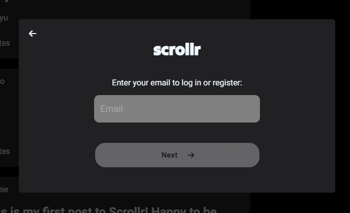
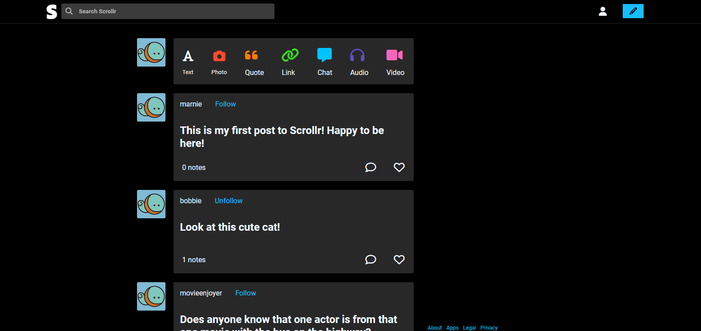
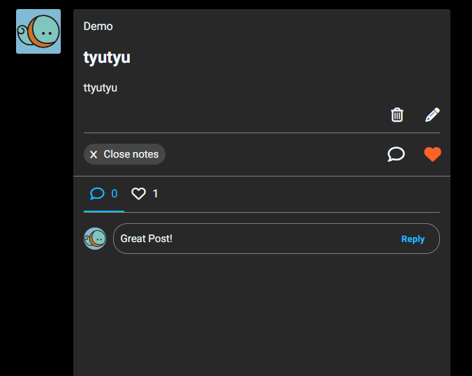
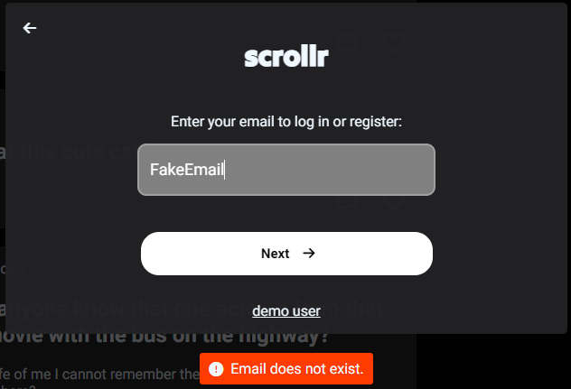

# Flask React Project

a name="readme-top"></a>

<br />
<div align="center">
  <a href="https://github.com/NRH-AA/Python_Project.git">
    
  </a>

<h3 align="center">Scrollr</h3>

  <p align="center">
    A clone of the popular Tumblr web application. Scrollr is a place to share ideas and opinions with others. You are able to post, comment and  even follow other users.
    <br />
    <a href="https://github.com/NRH-AA/Python_Project.git"><strong>Explore the docs »</strong></a>
    <br />
    <br />
    <a href="https://github.com/NRH-AA/Python_Project.git/issues">Report Bug</a>
    ·
    <a href="https://github.com/NRH-AA/Python_Project.git/issues">Request Feature</a>
  </p>
</div>


<details>
  <summary>Table of Contents</summary>
  <ol>
    <li>
      <a href="#about-the-project">About The Project</a>
      <ul>
        <li><a href="#built-with">Built With</a></li>
      </ul>
    </li>
    <li>
      <a href="#getting-started">Getting Started</a>
      <ul>
        <li><a href="#prerequisites">Prerequisites</a></li>
        <li><a href="#installation">Installation</a></li>
      </ul>
    </li>
    <li><a href="#usage">Usage</a></li>
    <li><a href="#roadmap">Roadmap</a></li>
    <li><a href="#contributing">Contributing</a></li>
    <li><a href="#license">License</a></li>
    <li><a href="#contact">Contact</a></li>
    <li><a href="#acknowledgments">Acknowledgments</a></li>
  </ol>
</details>


## About The Project
'A clone of the popular Tumblr web application. Scrollr is a place to share ideas and opinions with others. You are able to post, comment and  even follow other users.'

<p align="right">(<a href="#readme-top">back to top</a>)</p>


### Built With


* React
* JavaScript
* Python
* HTML
* CSS
* Flask


<p align="right">(<a href="#readme-top">back to top</a>)</p>


## Getting started


1. Clone this repository (only this branch)

2. Install dependencies

      ```bash
      pipenv install -r requirements.txt
      ```

3. Create a **.env** file based on the example with proper settings for your
   development environment

4. Make sure the SQLite3 database connection URL is in the **.env** file

5. This starter organizes all tables inside the `flask_schema` schema, defined
   by the `SCHEMA` environment variable.  Replace the value for
   `SCHEMA` with a unique name, **making sure you use the snake_case
   convention**.

6. Get into your pipenv, migrate your database, seed your database, and run your Flask app

   ```bash
   pipenv shell
   ```

   ```bash
   flask db upgrade
   ```

   ```bash
   flask seed all
   ```

   ```bash
   flask run
   ```

7. To run the React App in development, checkout the [README](./react-app/README.md) inside the `react-app` directory.


<p align="right">(<a href="#readme-top">back to top</a>)</p>


## Usage



Create your account with secure hashed password protection.



The home page displays the Feed that shows all of the posts others have shared.



You may comment or like a post and even follow another user if you enjoy their content.



With validation in place any errors that you may encounter are intuitively brought to the users attention.


<p align="right">(<a href="#readme-top">back to top</a>)</p>


## Roadmap

- [ ] Followers
- [ ] Posts
- [ ] Likes
- [ ] Comments


See the [open issues](https://github.com/NRH-AA/Python_Project.git/issues) for a full list of proposed features (and known issues).

<p align="right">(<a href="#readme-top">back to top</a>)</p>


## Contributing

Contributions are what make the open source community such an amazing place to learn, inspire, and create. Any contributions you make are **greatly appreciated**.

If you have a suggestion that would make this better, please fork the repo and create a pull request. You can also simply open an issue with the tag "enhancement".
Don't forget to give the project a star! Thanks again!

1. Fork the Project
2. Create your Feature Branch (`git checkout -b feature/AmazingFeature`)
3. Commit your Changes (`git commit -m 'Add some AmazingFeature'`)
4. Push to the Branch (`git push origin feature/AmazingFeature`)
5. Open a Pull Request

<p align="right">(<a href="#readme-top">back to top</a>)</p>


<p align="right">(<a href="#readme-top">back to top</a>)</p>


## Contact
<pre>
Patrick McKinney -  CorkscrewHollow@gmail.com
Nathan Heinz -
(James) Xinbo Zhou -
John Timothy Cruz - tim@cruz-family.ws
</pre>
Project Link: [https://github.com/NRH-AA/Python_Project.git](https://github.com/NRH-AA/Python_Project.git)

<p align="right">(<a href="#readme-top">back to top</a>)</p>


<p align="right">(<a href="#readme-top">back to top</a>)</p>

[React.js]: https://img.shields.io/badge/React-20232A?style=for-the-badge&logo=react&logoColor=61DAFB
[React-url]: https://reactjs.org/
